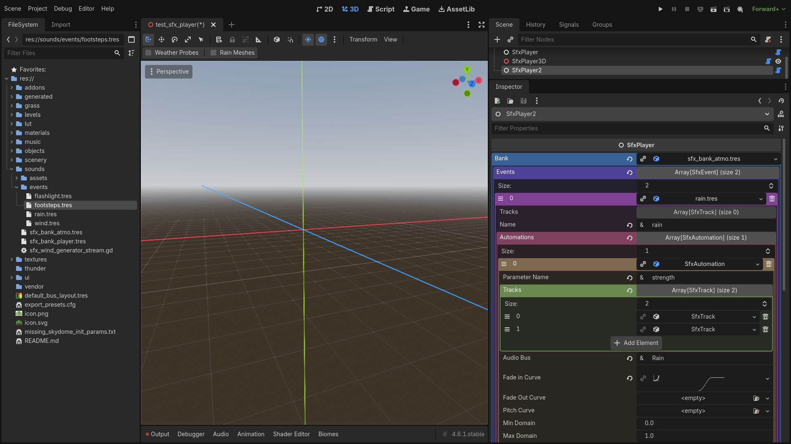

# Godot SFX

Simple Sound Effects System for Godot inspired by FMOD

## Features

* Sound effect banks for organization and reuse
* Sound events with multiple tracks and automation for sample blending
* Time based and parameter based playback
* Fade-in and fade-out curves
* Routing tracks to audio buses
* Uses built-in AudioStreams
* Native implementation for Godot
* Open source

## Hints

* Use `AudioStreamRandomizer` for sequential, shuffle or random playback of multisamples
* Use `AudioStreamPlaylist` to play multisample automatically ina a sequence

## TODO

* Custom loops for samples (independent from import time)
* Multiple samples per track
* Automation of Audio Bus and it's effects
* Standalone Sound Effect Maker (similar to Material Maker, inspired by FMOD)
